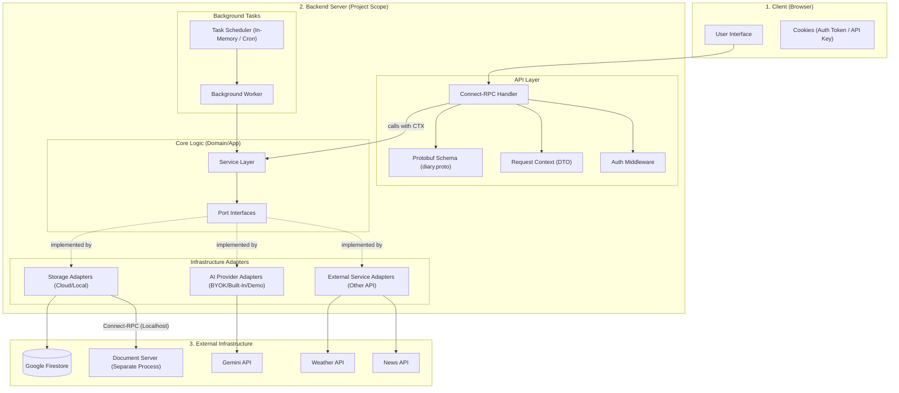

# Backend Architecture

このドキュメントは、ヘキサゴナルアーキテクチャ（Ports & Adapters）に基づき、バックエンドサーバの内部構造と外部連携のメカニズムを定義する。

## 1. システム構成図 (Mermaid)



## 2. サービス層 (Service Layer) の責務

各サービスは、ビジネスロジックの実行、リポジトリを介したデータ永続化、および外部連携のオーケストレーションを担う。
**エンティティやバリューオブジェクトの具体的な構造については、`dataschema.md` を参照すること。**

### 1. Diary Service (日記サービス)
- **対話の開始と外部情報候補の取得**: 新規の日記対話を開始する際、`IWeatherProvider` および `INewsProvider` を呼び出し、その日の天気と主要ニュースの**候補を事前取得**する。
    - これらの候補はフロントエンドに提供され、ユーザーが実際に日記に含めるものを選択する。
    - AI は取得された候補情報をコンテキストとして読み込み、それらを前提としたパーソナライズされた問いかけ（「今日は雨でしたが、どう過ごしましたか？」等）を行うことが可能になる。
- **対話の管理**: ユーザー入力を受け取り、AIProvider から**ストリーミング形式で**応答を取得し、対話履歴として保存する。
- **永続化のタイミング**: 
    - **チャット履歴**: 各発言（AI応答含む）の生成が完了したタイミングで、逐次 `IDiaryRepository` へ保存する。これにより、不意の切断時もそこまでの対話が保持される。
    - **日記本文と付随情報**: 対話終了判定（確定ボタン押下等）に基づき、最終的な日記本文、および**ユーザーが選択した天気・ニュース情報**が確定したタイミングで保存する。
- **中断時の処理**: ユーザーによる割り込みやネットワーク切断によってAIの応答生成が中断された場合、その未完の応答（ChatEntry）は永続化層へ保存せず破棄する（物理削除）。これにより、履歴の整合性とクリーンさを保つ。
- **対話の終了判定**: 以下のいずれかの場合に「対話終了」とみなし、日記の形成および会話コンテキストの永続化を行う。
    - ユーザーが画面上の「確定（日記生成）」ボタンを押下した。
    - 一定時間（セッションタイムアウト）入力がなかった。
- **日記の形成**: 対話終了時に AIProvider を呼び出し、対話を整理して日記本文を生成・保存する。
    - **トピックの自動生成**: 対話内容を要約し、日記エントリのトピックを AI が自動的に生成する。ユーザーは生成後にこれを手動で修正できる。
    - **コンテキストの永続化**: 抽出された会話コンテキストを `IConfigRepo` に保存し、長期記憶として管理する。
- **データ操作**: 日記・チャットの取得、更新、削除を統括する。検索クエリに対しては、リポジトリが提供する検索機能を用いて高速なアクセスを実現する。


### 2. Summary Service (要約サービス)
- **集計・要約の実行**: 特定期間の日記データを収集し、AIProvider を用いて要約を生成・保存する。
- **実行トリガーの制御**: 運用モード（Cloud/Self-host）に基づき、実行タイミングを制御する。
    - クラウド版: ユーザーによるフロントエンドからの明示的なリクエスト（手動）を主眼とする。
    - セルフホスト版: 設定されたスケジュール（毎週月曜0時等）に基づく自動生成をサポートする。
- **要約の管理**: 生成済み要約の取得、ユーザーによる修正の反映、削除を担う。(リポジトリを合成する)


## 3. ポート層 (Port Layer) の定義
外部システムやストレージへのアクセスを抽象化したインターフェース群。

### 3.1 ストレージ関連 (Repositories)

#### IDiaryRepository (日記リポジトリ)
日記データ（Diary）および対話履歴（Chat）の**すべてのライフサイクルとアクセス**を担う。ファイルへの書き込みやDB保存だけでなく、検索用インデックスの管理もこのリポジトリに集約される。

- **日記エントリの操作 (CRUD)**:
    - **概要**: 日記本体（DiaryEntry）の保存、取得、更新、削除。
    - **入力**: 実行コンテキスト、日記ID、保存内容。
    - **Markdown対応**: 
        - **Self-Host 実装**: データを Markdown ファイル (`.md`) として保存し、メタデータ（トピック、天気、ニュース等）を YAML Frontmatter として統合する。
        - **Cloud 実装**: Firestore 等のドキュメント DB に構造化データとして保存。
        - **エクスポート**: `getMarkdownContent(diaryId)` 等のメソッドを介し、保存形式を問わず Markdown 形式のバイナリ/文字列を返却する。このとき, YAML Frontmatterなどの形式も厳密に守ること.
- **対話履歴（チャット）の操作**:
    - **概要**: ユーザーとAIの個々の発言内容を履歴として記録・管理する。
    - **入力**: 実行コンテキスト、日記ID、発言内容（ユーザー/AIの識別を含む）、発言時刻、フィードバック情報。
    - **期待される振る舞い**: 
        - 特定の日記に紐付くチャットを時系列で保存する。
        - ユーザーからの特定の返答（フィードバック）を、後から発言に紐付けて更新できるようにする。
- **対話の巻き戻し・分岐処理**:
    - **概要**: ユーザーが過去の発言を編集し、対話をやり直す際の後続データ破棄（論理削除等）。
    - **期待される振る舞い**: 指定された時刻よりも後に記録されたチャット履歴を破棄（または無効化）する。
- **検索・抽出操作 (Search & Listing)**:
    - **ドキュメント管理の分離**: セルフホストモードでは、検索用インデックスの管理や Markdown への変換は独立した **Document Server** が担う。`LocalDiaryRepository` はそのクライアントとして機能する。
    - **フィルタリング**: 日記ID、日付範囲、トピック、天気等のメタデータに基づく抽出。ページング用カーソル対応。
    - **メタデータキャッシュ**: カレンダー表示等のために、YAML Frontmatter の一部（トピック、天気、タグ）を高速に返却する。
- **一貫性の担保**: 保存時にインデックスも自動的に更新されることを保証する。インデックスが破損した際の「再構築（Reindex）」メソッドも提供する。

#### ISummaryRepository (要約リポジトリ)
特定の期間（週間・月間）における日記の内容を集約した「まとめ」情報を管理する。

- **要約エントリの操作 (CRUD)**:
    - **概要**: AIによって生成された要約の保存、更新、削除、および個別の取得。
    - **入力**: 実行コンテキスト、要約ID、更新後の要約内容（本文、トピックなど）。
    - **期待される振る舞い**: 
        - 生成された要約を、一意のIDと共に永続化層に保存する。
        - 保存済みの要約について、ユーザーによる手動修正（本文の書き換えなど）を反映して更新する。
- **対象範囲（期間・粒度）に基づく検索・管理**:
    - **概要**: 週間・月間といった「粒度」や、対象となる「日記のID群」を考慮した取得と管理。内部でインデックスを最適化して保持する。
    - **入力**: 実行コンテキスト、まとめの粒度（週間/月間の別）、期間フィルタ（開始日・終了日）、取得件数制限、ページ移動用の目印（カーソル）。
    - **期待される振る舞い**: 
        - 指定された粒度や期間に合致する要約を一覧として取得する。
        - 各要約が「どの日記エントリ（ID）を元に作成されたか」という紐付け情報を保持し、必要に応じて参照できるようにする。

#### IConfigRepository (設定リポジトリ)
ユーザー個別の設定情報（Config）の保存および取得を担う。

- **設定項目**:
    - AI動作モード: BYOK / Built-In / Demo の選択。AIProviderの実装選択に用いる.
    - ペルソナ: ユーザーが明示的に指定する情報（自己紹介、好みなど）。AIProviderの応答生成のカスタマイズに用いる.
    - 会話コンテキスト: AIとの対話から自動的に抽出された情報（興味、習慣、重要なイベントなど）。
    - ※ これらを合わせたものを「ユーザプロファイル」と呼ぶ。
- **ユーザー設定の取得**:
    - **概要**: 実行コンテキスト（ユーザー識別情報）に基づき、現在保存されている全ての設定項目を取得する。
- **ユーザー設定の更新・保存**:
    - **概要**: ユーザーが変更した設定情報を永続化層に保存する。

### 3.2 外部連携関連 (Providers)

#### IAIProvider (AIプロバイダー)
AI連携（Gemini API等）を抽象化し、サービス層に提供する。

- **1. 対話応答の生成 (Chat Completion - Streaming)**
    - **概要**: ユーザーの入力と履歴に基づき、ストリーミング形式でトークン単位の応答を生成する。
    - **期待される振る舞い**: 
        - 接続が中断された場合は生成を停止する。
        - ユーザプロファイルを考慮し、パーソナライズされた応答を逐次返却する。
- **2. 日記内容の形成・整理**
    - **概要**: 対話記録から日記本文を構成する。
- **3. 要約の生成**
    - **概要**: 複数日記から週間・月間のまとめを生成する。
- **4. 会話コンテキストの抽出・更新**
    - **概要**: 対話から長期的に保持すべき特徴を抽出する。

#### IWeatherProvider
- **概要**: 特定日時の天気・気温情報の取得。

#### INewsProvider
- **概要**: 特定日の主要ニュース情報の取得。


## 4. 設計の重要ポイント

- **Request Context 注入**: `API Layer` で生成された `CTX` を Adapter まで伝搬する。
- **DI (依存性の注入)**: 起動時の環境変数（`APP_MODE`）に基づき、Adapter の具象クラスを動的に選択する。
- **エントリポイントの分離 (Hybrid Entry Strategy)**: 
    - クラウド環境でのネイティブ依存（SQLite3等）の衝突やビルドサイズの肥大化を防ぐため、実行バイナリ/エントリポイントを論理的に分離する。
    - `src/entry-cloud.ts`: `FirestoreAdapter` と厳密な `Auth Middleware` を DI して起動。サーバーレス環境（Cloud Run 等）向け。
    - `src/entry-local.ts`: `LocalDocumentAdapter` と簡易 `Auth Middleware` を DI して起動。デスクトップ/ローカル環境向け。
    - コアロジック（`Service Layer`）は完全に共通化し、ポータビリティを確保する。

## 5. エラーハンドリング戦略 (Layered Error Pattern)

各レイヤーで固有のエラー型（Enum）を定義し、上位レイヤーが下位レイヤーのエラーを「まるごと合成（ラッピング）」することで、情報の機密性保持とデバッグの容易性を両立する。

### 5.1 レイヤー別のエラー定義

| レイヤー | エラーオブジェクト名 | 主な Code (Connect-RPC) | 説明 |
| :--- | :--- | :--- | :--- |
| **API Layer** | `APIError` | `Internal`, `Unauthenticated`, `PermissionDenied`, `NotFound`, `ResourceExhausted`, `InvalidArgument` | クライアントへ返す最終的なレスポンス形式。Connect-RPC 標準のステータスコードと1対1で対応する。 |
| **Domain Layer** | `DomainError` | `DIARY_NOT_FOUND`, `BUDGET_EXCEEDED`, `INVALID_OPERATION`, `INTEGRITY_ERROR` | ビジネスロジック上の意味を持つ。下位の `ProviderError` を `cause` として保持する。 |
| **Provider Layer**| `ProviderError` | `NETWORK_ERROR`, `AUTH_FAILED`, `RATE_LIMIT`, `DISK_FULL`, `UPSTREAM_5XX` | 外部サービスやI/O固有のエラー。生のエラーメッセージやスタックトレースを保持する。 |


### 5.2 エラーの伝搬と合成のフロー

1.  **発生 (Provider)**: `DemoAIAdapter` 等が外部APIの制限を検知し、`ProviderError(code: RATE_LIMIT)` をスロー。
2.  **ラップ (Domain)**: `DiaryService` がそれをキャッチし、ドメイン文脈の `DomainError(code: BUDGET_EXCEEDED, cause: ProviderError)` として再スロー。
3.  **変換 (API)**: Middleware/Router がキャッチし、`APIError(code: ResourceExhausted, details: DomainError)` を生成。
4.  **レスポンス**:
    *   **本番環境**: `details` (内部エラー詳細) を除外し、安全なメッセージのみを返す。
    *   **開発環境 / ログ**: `details` を辿って `ProviderError` の生メッセージまで含めて記録する。

### 5.3 発生する例外の例

#### BudgetOverrun

Demoモードにおける利用制限は、`ProviderError.RATE_LIMIT` -> `DomainError.BUDGET_EXCEEDED` -> `APIError.ResourceExhausted` の順で変換され、ユーザーには「利用枠の終了」と「BYOKへの誘導」を行うメッセージとして提示される。

#### SessionTimeout

ユーザーセッションの無効化に関するエラー。以下の複数の原因が存在する。

##### 5.3.1 SessionTimeout の発生原因と分類

| 原因 | 発生箇所 | エラーコード | 対応レイヤー |
| :--- | :--- | :--- | :--- |
| **AIストリーミング接続タイムアウト** | AIProvider | `SESSION_TIMEOUT_PROVIDER` | Provider → Domain → API |
| **認証トークン有効期限切れ** | Auth Middleware | `SESSION_EXPIRED` | API |
| **サーバー側セッション無効化** | Server | `SESSION_INVALIDATED` | API |

##### 5.3.2 AIストリーミング接続タイムアウト (SESSION_TIMEOUT_PROVIDER)

対話中のAI応答ストリーミングが途中で切断される場合。

**発生条件**:
- ネットワーク不安定地域でのストリーミング中断。
- AIProvider側（Gemini API等）のコネクションタイムアウト（通常: 60秒以上の無レスポンス）。
- サーバー側のソケットタイムアウト（通常: 90秒）。

**エラー伝搬**:

1. **Provider層で検出**:
   ```
   ProviderError(
     code: SESSION_TIMEOUT_PROVIDER,
     message: "Streaming connection timeout after 60s",
     originalError: <network error details>
   )
   ```

2. **Domain層でキャッチ・変換**:
   ```
   DomainError(
     code: INVALID_OPERATION,
     message: "AI応答生成中にタイムアウトが発生しました。",
     cause: ProviderError(SESSION_TIMEOUT_PROVIDER)
   )
   ```

3. **API層で最終変換**:
   ```
   APIError(
     code: GatewayTimeout,
     httpStatus: 504,
     message: "AI応答の生成に時間がかかっています。もう一度お試しください。",
     details: { cause: DomainError }  // 本番環境では除外
   )
   ```

**クライアント対応**:
- ステータス `504 Gateway Timeout` を受け取った場合、「もう一度送信」のプロンプトを表示。
- 既に生成されたトークンのうち、確実に受け取れた部分は段階的UI更新（Optimistic UI）で表示。
- リトライ時は、**同じプロンプトを新規チャットとして扱う**（重複防止）。

**リトライ戦略（Domain層の責務）**:
- `DiaryService.resumeChat()` メソッドで、失敗直前の状態からリトライ可能にする。
- 最大リトライ回数: 3回。
- リトライ間隔: 2秒（指数バックオフ: 2s, 4s, 8s）。

##### 5.3.3 認証トークン有効期限切れ (SESSION_EXPIRED)

JWT等の認証トークンが失効した場合。

**検出と処理**:

1. **Auth Middleware で検出**:
   ```
   if (token.isExpired()) {
     throw APIError(
       code: Unauthenticated,
       httpStatus: 401,
       message: "セッションが失効しました。再度ログインしてください。"
     )
   }
   ```

2. **クライアント対応**:
   - ステータス `401 Unauthenticated` を受け取った場合、ローカルストレージのトークンを削除してログイン画面へリダイレクト。
   - Refresh Token がある場合は、自動的にアクセストークンを更新してからリトライ。

3. **トークンリフレッシュ仕様**:
   - Access Token 有効期限: 1時間。
   - Refresh Token 有効期限: 7日間。
   - Refresh Token による自動更新は、リクエスト中に自動実行（クライアント透過）。

##### 5.3.4 サーバー側セッション無効化 (SESSION_INVALIDATED)

ユーザーのセッションが管理者によって明示的に無効化された場合。

**発生シナリオ**:
- ユーザーが他のデバイスからログインし、前のセッションが無効化される。
- セキュリティ上の理由（異常なアクセスパターン検知等）によるセッション強制終了。
- パスワード変更後の既存トークン無効化。

**検出と処理**:
- Auth Middleware で `ISessionRepository.isSessionValid(sessionId)` を確認。
- 無効な場合は `APIError(code: Unauthenticated, httpStatus: 401)` を返す。

**クライアント対応**:
- ステータス `401 Unauthenticated` を受け取った場合、同様にログイン画面へリダイレクト。
- オプション: 強制ログアウト理由をユーザーに表示（「別のデバイスからログインしました」等）。

##### 5.3.5 ロギングとモニタリング

**ログ出力**:
- 各タイムアウトエラーは **WARN レベル** で記録。
- スタック トレースおよび原因となった要因（タイムアウト時刻、最後の入力時刻等）を含める。
- 例:
  ```
  [WARN] SessionTimeout: type=SESSION_TIMEOUT_INACTIVE, 
           userId=user_123, diaryId=diary_456,
           lastInputAt=2026-03-13T14:30:00Z, 
           timedoutAt=2026-03-13T14:35:05Z,
           threshold=300s
  ```

**メトリクス収集**:
- セッションタイムアウト発生数（時間ひとりあたり、タイプ別）。
- 平均対話時間（タイムアウト前に完了した対話）。
- ユーザーごとのタイムアウト発生率（異常検知に利用）。

## 6. 認証・認可およびセキュリティ戦略 (Security & Auth)

本システムは、運用モードに応じて最適な認可メカニズムを採用する。いずれのモードにおいても、`Auth Middleware` がリクエストを検証し、成功した場合は `Request Context` に `userId` を注入する。これにより、後続の `Service Layer` は認証方式の違いを意識することなく処理を行える。

### 6.1 Auth Token (認証トークン) の種別

API リクエストの正当性を証明するトークンを `Auth Token` と総称する。

| モード | トークン名称 | 生成・検証メカニズム | 目的 |
| :--- | :--- | :--- | :--- |
| **クラウド** | `Auth Token` (JWT) | Google SSO (OIDC) 連携。検証後、バックエンドが JWT を発行。 | ユーザー識別 (Multi-tenant) および認可。 |
| **セルフホスト** | `Local Auth Token` | アプリケーション起動時にランダム生成。Cookie 経由でフロントエンドへ配布。 | **セキュリティ保護 (CSRF/不正アクセス防止)**。識別は不要。 |

### 6.2 運用モード別のセキュリティフロー

#### A. クラウドモード
- **認証**: Google ID Token を検証し、ユーザーの一意な識別子（`sub` ID）を `userId` として採用。
- **認可**: 検証成功後、セッション用の JWT 形式の **`Auth Token`** を発行。
- **テナント分離**: ストレージアダプター（Firestore 等）は、`userId` に基づき `/users/{userId}` 配下のデータのみにアクセスを制限する。
- **トークン管理**: トークンは `HttpOnly`, `Secure`, `SameSite=Strict` 属性付きの Cookie に保存する。

#### B. セルフホストモード
セルフホスト環境では、以下のライフサイクルで `Local Auth Token` を運用し、セキュリティを確保する。

1.  **トークンの生成 (Startup)**:
    *   システム起動時（ランチャーまたは Document Server）、暗号学的に安全なランダム文字列（`Local Auth Token`）をメモリ上に生成する。
2.  **プロセス間共有 (Internal)**:
    *   **DocServer → Backend**: `DOCSERVER_AUTH_TOKEN` 環境変数を介して、DocServer, Backend プロセスの通信用トークンを共有する.
    *   **Backend → Frontend**: `BACKEND_AUTH_TOKEN` 環境変数を介して、Backend, Frontend (Next.js) プロセスの通信用トークンを共有する.
3.  **ブラウザへの配布 (Handshake)**:
    *   ユーザーがブラウザでアクセスした際、Frontend-Client 層は `Set-Cookie` ヘッダーを用いてトークン（`Auth Token`）をブラウザに保持させる。
4.  **リクエストの検証 (API Call)**:
    *   `Auth Middleware` は、以降の RPC リクエストに含まれる Cookie 内のトークンを、メモリ上の正解値と照合する。

### 6.3 トークン管理の原則
- **隠蔽化**: トークンの生成、検証、Cookie へのセットは `API Layer` (Middleware/Entry Point) で完結させる。`Service Layer` 以降のドメインロジックがトークンの具体的内容や種別を知る必要はない。
- **有効期限**: クラウド版は JWT の標準的な有効期限に従う。セルフホスト版はアプリケーションのプロセス終了まで有効とする。

### 6.4 BYOK (Bring Your Own Key) の保持戦略

ユーザーの Gemini API キーは、以下の通り管理される。

1.  **クラウドモード (Volatile)**:
    - **保存**: キーを DB に永続化せず、`HttpOnly`, `Secure` 属性付きの Cookie としてブラウザに保持させる。
2.  **セルフホストモード (Persistent)**:
    - **保存**: デバイス上の設定ファイル（`settings.json`）に永続化し、バックグラウンド実行時も利用可能とする。

## 7. 定期実行とトリガー戦略 (Execution & Trigger Strategy)

要約生成など、非同期・定期的なタスクの実行メカニズム。

### 7.1 クラウドモード：オンデマンド実行
- **メカニズム**: `Scheduler` は無効化される。すべての要約生成は、フロントエンドからの `CreateSummary` RPC 呼び出しをトリガーとする。
- **理由**: API キーがブラウザの Cookie 内にのみ存在するため、ユーザーがアクティブ（リクエスト送信中）である必要がある。

### 7.2 セルフホストモード：ハイブリッド実行
- **Scheduler (In-Memory)**: アプリケーションプロセス内で動作する軽量なスケジューラ。あるいはcron向けに提供されたエンドポイント.
    - **定期要約**: 設定ファイル（`settings.json`）で指定された周期（デフォルト：毎週月曜 04:00）に `Worker` をキックする。
- **Worker**: 実際のビジネスロジック（`SummaryService` 等）を呼び出す実行主体。
- **リトライ制御**: ネットワークエラー等で失敗した場合は、指数バックオフを用いて最大3回まで再試行する。再試行に失敗した場合はエラーログを記録し、次回の定期実行まで待機する。
