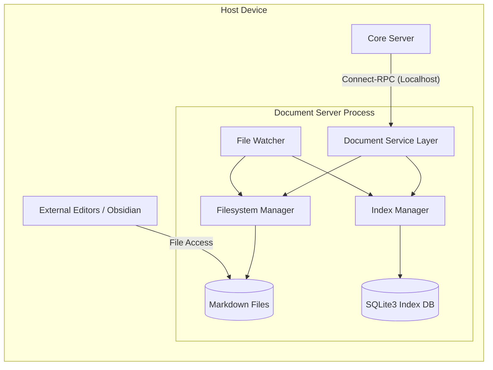

# Document Server Architecture

このドキュメントは、セルフホスト環境において日記ドキュメント（Markdown）の保存、同期、および高速な検索を提供する「Document Server」の内部構造とAPIを定義する。

## 1. 概要

Document Server は、DiaLogCoreサーバーからの要求を受け、ローカルファイルシステム上の Markdown ファイルと、その内容をインデックス化した SQLite3 データベースを統合的に管理する独立したサービスプロセスである。

### 主な責務
- **ドキュメントの永続化**: Markdown ファイルとしての保存、読み込み。
- **インデックス管理**: YAML Frontmatter のインデックス（SQLite3等）の構築。
- **ファイル監視・同期**: 外部エディタ等によるファイル変更を検知し、インデックスを自動更新する。
- **ポータビリティの提供**: 他のツール（Obsidian, Logseq等）と共存可能なディレクトリ構造の維持。

## 2. システム構成図 (Mermaid)

## 3. インターフェース (API)

Document Server は **Connect-RPC (gRPC compatible over HTTP/2)** を使用して通信を行う。以下に主要なサービス定義（Protobuf）の概要を示す。

### 3.1 DocumentService の機能定義

Document Server が提供する主要な機能（APIインターフェース）は以下の通り。

- **ドキュメントの取得・一覧**
  - **ドキュメント一覧の取得**: 指定された条件（フィルタやページネーション）に基づき、ドキュメントのメタデータ一覧を取得する。
  - **個別ドキュメントの取得**: 特定のドキュメントの詳細情報（本文、メタデータ、パス等）を取得する。

- **作成・更新・削除**
  - **ドキュメントの新規作成**: 新しい Markdown ファイルを生成し、インデックスに登録する。
  - **ドキュメントの更新**: 既存のファイル内容や Frontmatter を書き換え、インデックスを最新の状態に更新する。
  - **ドキュメントの削除**: 指定されたドキュメントのファイルを物理削除し、インデックスからも抹消する。

- **検索・分析**
  - **ドキュメント検索**: 日付範囲、タグなどを組み合わせた検索を実行する。
  - **タグ一覧の取得**: ドキュメント群から抽出された全タグをリストアップし、集計・分析に供する。

- **メンテナンス・状態管理**
  - **再インデックス**: ローカルの全 Markdown ファイルを再スキャンし、SQLite3 インデックスを強制的に同期・再構築する。
  - **ステータス確認**: サーバーの稼働状況、インデックスの整合性、ファイル監視の動作状態などのヘルスチェック情報を取得する。

#### 主なメッセージ型
- `Document`: Markdown本文、YAMLメタデータ、ファイルパス、ハッシュを含む。
- `SearchQuery`: 日付範囲フィルタ、タグフィルタ。

## 4. 実行形態と通信

- **バイナリ**: DiaLogCoreとは別の独立した実行ファイルとしてビルドされる。
- **接続**: `localhost:50051` (デフォルト) 等のポートで待機。
- **認証（鍵共有スキーム）**:
    - **生成**: 適当な方法で生成して環境変数`DOCSERVER_AUTH_TOKEN`に格納する
    - **共有**: DiaLogCoreとDocServerが同じ環境変数を参照することで鍵共有する
    - **検証**: DocServer は起動時に環境変数からトークンを読み込み、以降のDiaLogCoreからのリクエストに含まれるトークンと照合する。
    - 詳細は `backend-arch.md` のセキュリティセクションを参照。

## 5. インデックス設計 (SQLite3)

### テーブル構造

1. **documents**:
    - `id` (UUID, PK)
    - `path` (String, UNIQUE): ファイルシステム上の相対パス。
    - `topic` (String)
    - `weather_summary` (String, Nullable): 天気概要（例：晴れ）。
    - `weather_temperature` (Float, Nullable): 気温。
    - `created_at` (Datetime): Frontmatter 上の作成日時。
    - `updated_at` (Datetime): Frontmatter 上の更新日時。
    - `content_hash` (String): ファイル全体の内容（Frontmatter+本文）から算出されたハッシュ値。外部編集の検知に使用する。
    - `status` (String): インデックス状態 (`ok`, `warning`, `error`)。
    - `error_message` (Text, Nullable): パース失敗時のエラー詳細。

2. **document_news**:
    - `id` (Integer, PK)
    - `document_id` (UUID, FK -> documents.id): 親ドキュメントへの参照。
    - `title` (String): ニュースタイトル。
    - `url` (String): ニュース記事のURL。
    - `source` (String): 情報元。
    - `published_at` (Datetime): 記事の公開日時。

3. **document_tags**:
    - `document_id` (UUID, FK -> documents.id)
    - `tag` (String): タグ名。
    - PRIMARY KEY (`document_id`, `tag`)

## 6. 同期戦略

### 6.1 書き込み時 (Write-Through)
DiaLogCoreからの保存要求時は、以下の手順で同期を行う：
1. 指定されたディレクトリ構造に従い `.md` ファイルを書き込む。
2. 書き込み成功後、SQLite3 インデックスを更新する。

### 6.2 外部変更時 (Background Sync)
File Watcher を使用し、`.md` ファイルの変更を監視する：
- **追加/変更**: ファイルの Frontmatter と本文をパースし、インデックスを差分更新する。
- **削除**: 対応するレコードを DB から削除する。

## 7. バリデーションと回復性 (Validation & Resilience)

外部エディタ（Obsidian等）による編集を許容するため、Document Server は以下の回復メカニズムを備える。

### 7.1 パース時の整合性チェック
ファイル監視による検知時、または明示的な読み込み時に以下の検証を行う：
- **YAML Frontmatter の存在**: `---` で囲まれたメタデータブロックが存在するか。
- **必須フィールドの欠損**: `id`, `topic`, `created_at` 等の必須項目が記述されているか。
- **Markdown 構造の維持**: 日記本文（`## Diary` 等）がパース可能か。

### 7.2 破損時の回復戦略 (Graceful Recovery)
パースエラー（構文エラーや必須フィールド欠損）が発生した場合、以下の優先順位で情報を補完・修復する：
1.  **インデックス DB からの復旧**: ファイルが破損していても、SQLite3 側に直近の正常なメタデータが残っている場合はそれを使用して補完を試みる。
2.  **ファイル名からの推論**: メタデータの `created_at` が不明な場合、ファイル名（`YYYY-MM-DD_...`）から日付を推定する。
3.  **デフォルト値の適用**: `topic` が不明な場合は「(無題)」とする等のフォールバックを行う。
4.  **警告ログとマーク**: 破損が深刻なファイルは `status` API で警告対象とし、ユーザーに通知可能な状態にする。

### 7.3 自動修復 (Auto-Repair)
Document Server は、読み込み時に軽微な構造不備（例：末尾の `---` 忘れ、空行の不足）を検知した場合、**メモリ上のデータを正規化してファイルへ書き戻す（正規化書き込み）** オプションを持つ。これにより、外部ツールによる破壊を自動的に最小化する。
