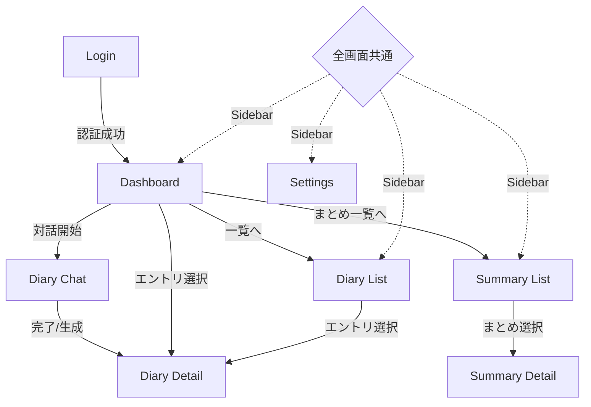

# UIServer Design

本ドキュメントは、日記アプリケーションのフロントエンド構成（画面、遷移、コンポーネント）を定義する。

## 1. 画面構成要素 (Screen Elements)

### 1.1 Dashboard (ダッシュボード)
- **Status Section**: 今日の日記の状態（未着手 / 作成中 / 完了）のラベル。
- **Quick Start**: 「対話を始める」ボタン。
- **History Preview**: 直近の日記エントリ（日付、トピック、本文抜粋）のリスト（3件程度）。
- **Summary Section**: 
    - 最新の週間/月間まとめへのリンク。
    - **「まとめを作成」ボタン**: 今週/今月のまとめが未作成の場合に、クイック生成を促すアクション。

### 1.2 Diary Chat (対話画面)
- **Navigation Bar**: 「一時保存して戻る」ボタン、現在の対話トピック表示。
- **Additional Information Area (Candidate Selection)**: 
    - DiaLogCoreから取得された「今日の天気」と「主要ニュース」の候補をカード形式で表示。
    - ユーザーは各カードに対して、日記に「採用」するかどうかをチェックボックスやトグルで選択する。
    - デフォルトでは AI が特に関連性が高いと判断したものが選択されているか、あるいは未選択状態から開始する。
- **Chat History Area**: スクロール可能なメッセージリスト。
    - Agent発言（左側）/ User発言（右側）。
    - **Streaming Display**: Agentの応答はストリーミングで逐次表示され、生成中は視覚的なインジケータ（カーソル等）を伴う。
    - Agent発言に付随するフィードバックボタン（Good/Bad）。
- **Message Input Area**: テキスト入力フィールド、送信ボタン。
- **Status Indicator**: 「AIが入力中...」の表示。
- **Action Bar**: 
    - **「対話を終了して日記を生成」ボタン（確定ボタン）**: これを押すことで対話を正式に終了し、日記本文の生成プロセス（および会話コンテキストの永続化）へ移行する。

AIの回答生成中に追加でユーザからメッセージがあった際は, 現在の回答生成を中断してユーザの発言を追記して再度生成を開始する. この際、中断された Agent の応答は物理削除し、履歴には残らない。

天気の情報は画面のデザインに反映される可能性がある.

### 1.3 Diary Detail (日記閲覧・編集画面)
- **Header**: 日付表示、トピック編集フィールド、エクスポートボタン（MD形式）。
- **Information Sidebar/Header**: 天気情報、関連ニュースのリスト（リンク付き）。
- **Content Area**: 
    - 閲覧モード：Markdownレンダリングされた本文。
    - 編集モード：プレーンテキストエディタ。
- **Footer**: 「編集」と「保存」の切り替えボタン、削除ボタン。

### 1.4 Diary List (日記一覧画面)
- **Filter/Search Bar**: 期間指定絞り込み。
- **View Switcher**: リスト形式 / カレンダー形式の切り替え。
- **Entry List**: 各行に日付、トピック、スニペット（本文冒頭）、削除ボタンを表示。

### 1.5 Summary List/Detail (まとめ画面)
- **Granularity Tab**: 「週間」/「月間」の表示切り替え。
- **Action Bar**:
    - **「まとめを生成」ボタン**: 
        - 未作成の期間（最新の週間/月間）を対象に、AIによる要約生成を開始する。
        - **Source Preview Area**: 生成実行前および実行中、要約の対象となる日記エントリ（または下位のまとめ）の一覧を表示する。ユーザーは対象範囲を確認した上で生成を開始できる。
        - 生成実行中はプログレスインジケータ（スケルトン等）を表示し、完了後に自動的に詳細画面へ遷移する。
- **Summary List**: 期間、トピック、作成日のリスト。
- **Summary Detail**: 
    - まとめ本文（Markdown）。
    - Source Diaries Section：このまとめの対象となった日記へのリンク集。
    - 編集/保存/削除ボタン。

### 1.6 Settings (設定画面)
- **Persona Config**: ペルソナ（ユーザー属性）入力フィールド、保存ボタン。
- **AI Context View**: AIが抽出した「会話コンテキスト」の閲覧, 編集.
- **API Configuration**: Gemini APIキー入力（マスク表示）、接続テストボタン。
- **Storage Info**: データの保存先パス（Self-Host時）の情報表示。

### 1.7 Login (認証画面 - Cloud Mode のみ)
- **Continue with Google Button**: Google SSO (OAuth2/OIDC) によるログインボタン。
- **Transition**: 成功後、DiaLogCoreから発行された `Auth Token` Cookie を受け取り、ダッシュボード（`/`）へ遷移する。

---

## 2. 画面遷移 (Screen Transitions)

## 3. URL 構造 (URL Structure)

Next.js (App Router) のファイルシステムベースルーティングを採用し、リソースごとに一意のURLを割り当てる。

| パス | 対応画面 | 役割・備考 |
| :--- | :--- | :--- |
| `/login` | Login / Signup | クラウドモード時の入り口。 |
| `/` | Dashboard | トップページ。状態確認、クイックスタート。 |
| `/diaries` | Diary List | 日記一覧。フィルタリングやカレンダー表示。 |
| `/diaries/[diaryId]` | Diary Detail | 特定の日記の表示・編集・エクスポート。 |
| `/diaries/[diaryId]/chat` | Diary Chat | AIとの対話（日記作成プロセス）。 |
| `/summaries` | Summary List | 週間・月間まとめの一覧。 |
| `/summaries/[summaryId]` | Summary Detail | 特定のまとめの表示・編集。 |
| `/settings` | Settings | ユーザ設定（APIキー、ペルソナ、ストレージ）。 |

---

## 4. 認証・認可の実装戦略 (Authentication Handling)

本システムはステートレス（Cookie 依存）な認可を採用するため、UIServerでは以下の対応を行う。

### 4.1 API 通信と Cookie の自動送信
`Auth Token` (およびクラウド版の API キー) は `HttpOnly` Cookie に格納されるため、UIServerの JS からは読み取れない。
- **Connect-RPC (`connect-es`)**: `credentials: 'include'` をトランスポート設定に指定し、ブラウザによる Cookie の自動送信を有効にする。

### 4.2 グローバルエラーハンドリング (401 監視)
セッション切れ（`SESSION_EXPIRED`, `SESSION_INVALIDATED`）等でDiaLogCoreが `401 Unauthorized` を返した場合の処理。
- **実装**: `connect-es` の `Interceptor` で 401 を検知。
- **アクション**: トースト通知を表示し、強制的に `/login` へリダイレクトする（セルフホスト時は再ロード）。

### 4.3 ルーティング保護 (Route Guards)
認証が必要なページ（AppShell 内部）へのアクセスを制限する。
- **実装**: `NEXT_PUBLIC_APP_MODE` が `cloud` の場合、グローバルステートの認証フラグを確認し、未認証なら `/login` へ飛ばすラッパーコンポーネントを配置。

---

## 5. モード別 UI 分岐 (UI Feature Flags)

環境変数 `NEXT_PUBLIC_APP_MODE` に基づき、UI を動的に出し分ける。

| コンポーネント | Cloud Mode の挙動 | Self-host Mode の挙動 |
| :--- | :--- | :--- |
| **Login 画面** | 必須 | 非表示（自動認可） |
| **Settings 画面** | Firestore 設定を表示（固定） | 保存先パス（ローカルディレクトリ）設定を表示 |
| **ログアウトボタン** | ヘッダーに表示 | 非表示 |
| **ストレージ情報** | 使用容量・プラン等を表示 | ファイルシステムパスを表示 |

### 5.1 セルフホストモードにおける自動認可
セルフホストモードでは、アプリケーション起動時にDiaLogCoreから発行された **`Local Auth Token`** が Cookie に自動的にセットされるため、ユーザーはログイン操作なしでダッシュボードにアクセスできる。詳細は `backend-arch.md` を参照。

---

## 6. コンポーネント構成 (Component Hierarchy)

### 6.1 Layout Components
- `AppShell`: 共通レイアウト（Sidebar, ContentArea）。
- `Navigation`: サイドバーメニュー。
- `StickyHeader`: ページタイトル、保存/編集等のアクションボタンの固定表示。

### 4.2 Feature-Specific Components
- **Chat**:
    - `ChatEngine`: 通信ロジックと状態管理。
    - `MessageList`: `MessageBubble` のコンテナ。
    - `MessageBubble`: 個別の発言とフィードバックボタン。
    - `InputSystem`: テキスト入力と送信制御。
- **Diary**:
    - `DiaryViewer`: Markdown表示用。
    - `DiaryEditor`: テキスト編集用。
    - `MetaPanel`: 天気・ニュースの表示カード。
- **Summary**:
    - `SummaryListGroup`: 期間ごとのリスト表示。
    - `SummaryGenerator`: 生成対象の期間選択、**対象となる日記エントリの一覧表示**、API呼び出し、生成中のステータス管理を行うコンポーネント。
    - `LinkedDiaryBadge`: 関連日記へのリンクバッジ。
- **Settings**:
    - `PersonaForm`: ユーザープロファイル入力。
    - `ContextTagList`: 抽出されたキーワードのリスト。

### 4.3 Common UI Components (Primitives)
- `Button`: 役割別（Primary, Secondary, Danger, Icon）。
- `InputField`: LabelとInputのセット。
- `Card`: 情報をまとめる枠。
    - `DiaryEntryCard`: 日記エントリを端的に表すカード. タップして日記エントリの詳細を確認できる.
- `Modal`: 削除確認、設定変更用。
- `DataGrid`: 一覧表示用のテーブル構造。

---

## 5. 技術スタック (Technical Stack)

- **Framework**: Next.js (App Router)
- **Language**: TypeScript
- **State Management**: 
    - Server State: `connect-es` (Connect-RPC)
    - Global State: React Context または Jotai (軽量な状態管理)
- **API Client**: `connect-es` (gRPC / Connect-RPC)
    - `diary.proto` から生成されたクライアントを使用し、Query, Mutation, Streaming を統合管理する。
- **Markdown Handling**: `react-markdown` (Viewer)
- **Styling**: Vanilla CSS (CSS Modules)
